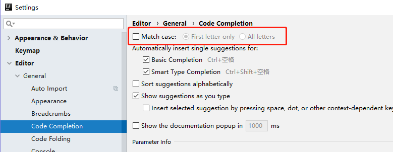
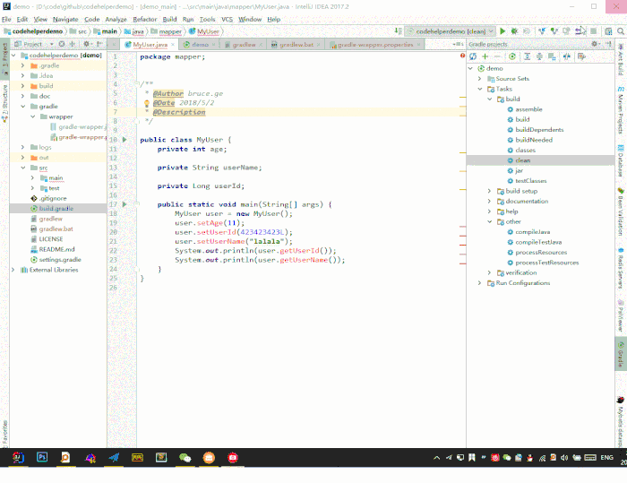

# Idea 插件
## 类和方法注释模板设置
### 类注释模板添加
File-->settings-->Editor-->File and Code Templates-->Files-->Class
```java
#if (${PACKAGE_NAME} && ${PACKAGE_NAME} != "")package ${PACKAGE_NAME};#end
#parse("File Header.java")
    /**
      * @ClassName ${NAME}
      * @Description ${description}
      * @Author Mr.Jangni
      * @Date ${DATE} ${TIME}
      * @Version 1.0
      **/
public class ${NAME} {
}
```

### 方法注释模板添加
File-->Settings-->Editor-->Live Templates
```java
 *
 * @Author Mr.Jangni
 * @Description $description$
 * @Date $date$ $time$
 * @Param $param$
 * @Return $return$
 **/
```

### 设置不区分下小写提示

## GsonFormat
使用快捷鍵 Alt+s
使用Json串生成对象字段
## Alibaba Java Coding
阿里巴巴 编码提示插件
## Rainbow Brackets
括号颜色插件
## iBATIS/MyBatis plugin
轻松通过快捷键找到MyBatis中对应的Mapper和XML
使用快捷键 Ctrl+Alt+B
## Background Image Plus
设置界面设置背景图片
File-Settings-Background Image Plus
选择背景图片存放路径，勾选Change every
## Maven Helper
1.打开项目的pom.xml文件，在文件编辑器的左下方，会看到两个tab，一个是“Text”，另一个是“Dependency Analyzer”；
2.根据错误提示，我们做出相应的修复
## Translation
鼠标选中你要翻译的单词或者语句，右键选择translate（可以查看你的快捷键）
## Lombok plugin
Java编程神器

## CodeGlance
大屏幕神器，在编辑区的右侧显示的代码地图，小屏幕不推荐使用。

